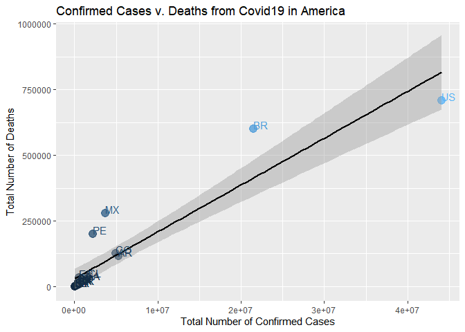
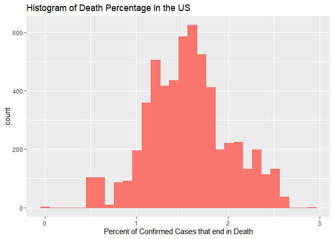
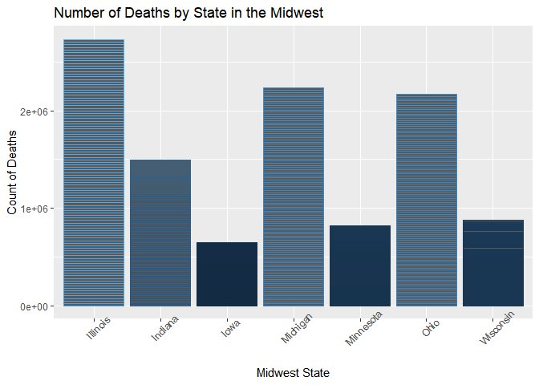

Vignette
================
Allison Warhus
10/5/2021

-   [Introduction](#introduction)
-   [Required Packages](#required-packages)
-   [Functions to Interact with the
    API](#functions-to-interact-with-the-api)
    -   [Here I define functions to interact with the COVID19
        API.](#here-i-define-functions-to-interact-with-the-covid19-api)
-   [Data Exploration](#data-exploration)

# Introduction

This is a vignette to demonstrate how to retrieve data from a the
COVID19 API. I will use some functions to retrieve and interact with
data from the covid API as an example.

# Required Packages

The following packages are required in order to interact with the
COVID19 API:  
*[`jsonlite`](https://cran.r-project.org/web/packages/jsonlite/):used
for API interaction.  
*[`httr`](https://cran.r-project.org/web/packages/httr/vignettes/quickstart.html):
used to map to the http protocol  
These packages are needed to run the functions I have written below.  
*[`tidyverse`](https://www.tidyverse.org/): used for data manipulation
and visualization.  
*[`dplyr`](https://dplyr.tidyverse.org/): grammar of data manipulation  
*[`tidyr`](https://tidyr.tidyverse.org/): creates tidy data  
This package is needed to create the plots in the Exploratory Data
Analysis section of the vignette.  
*[`ggplot2`](https://ggplot2.tidyverse.org/): a system to create
graphics from data.  
[`knitr`](https://yihui.org/knitr/): to build dynamic reports

# Functions to Interact with the API

## Here I define functions to interact with the COVID19 API.

`Total_Cases_Country`  
This function will return the total number of COVID19 cases, deaths and
recoveries from a user-specified country. The country can be given as a
full country name or a country ID. Data is returned as a data frame.

``` r
Total_Cases_Country<-function(country="all"){
  outputAPI<-GET('https://api.covid19api.com/summary')
  data5<-fromJSON(rawToChar(outputAPI$content))
  output<-data5$Countries
  if(country !="all"){
    if(country %in% output$CountryCode){
      output<-output %>%
        filter(CountryCode==country)
    }
    else if (country %in% output$Country){
      output<-output %>%
        filter(Country == country)
    }
    else{
      message<-paste("Error: Country not found")
      stop(message)
    }
  }
  else{
  }
  return(output)
}
```

`Country_By_Date`  
This function will return information about COVID19 based on a
user-specified country and for a specific, user-specific month and year
(2020 or 2021 only). Data is returned as a data frame.

``` r
Country_By_Date<-function(month=1, year=2021,country="Ukraine"){
  URL<-paste0("https://api.covid19api.com/dayone/country/",country)
  outputAPI<-GET(URL)
  data5<-fromJSON(rawToChar(outputAPI$content))
  output<-data5 %>% 
    separate("Date", c("Year", "Month","Day+"), sep="-", convert=TRUE, remove=FALSE)
  output<-output %>% 
    filter(Year== year) %>% 
    filter(Month == month) 
  return(output)
}
```

`Number_by_Type`  
This function will return the number of cases of a user-specified type
(confirmed cases, active cases, deaths or recovered cases) for a
user-specified country from day 1 of the pandemic (3/3/2020). Data is
returned as a data frame.

``` r
Number_by_Type<-function(type="deaths",country="Ukraine"){
   URL<-paste0("https://api.covid19api.com/dayone/country/",country,"/status/",type)
   outputAPI<-GET(URL)
   data5<-fromJSON(rawToChar(outputAPI$content))
   total<-cumsum(data5$Cases)
   data5<-data5 %>% 
     add_column(Total=total)
   return(data5)
}
```

`USA_by_Type`  
This function will return the number of cases of a user-specified type
(confirmed cases, active cases,deaths or recovered cases) in the USA.

``` r
USA_by_Type<-function(type="Deaths"){
  outputAPI<-GET('https://api.covid19api.com/live/country/USA')
  data<-fromJSON(rawToChar(outputAPI$content))
  if( type != "all"){
    data<-data %>% select(Province,type)
  }
  return(data)
}
```

`findID`  
This function will return the CountryID for a user-specified country.
Data is returned as a data frame.

``` r
findID<-function(country="all"){
  outputAPI<-GET('https://api.covid19api.com/summary')
  data5<-fromJSON(rawToChar(outputAPI$content))
    output<-data5$Countries
  if(country !="all"){
    if(country %in% output$CountryCode){
      output<-output %>%
        filter(CountryCode==country)
    }
    else if (country %in% output$Country){
      output<-output %>%
        filter(Country == country)
    }
    else{
      message<-paste("Error: Country not found")
      stop(message)
    }
  }
  else{
  }
  df<-data.frame(output$CountryCode)
  return(df)
}
```

`CovidAPI`  
This function is a shortcut to access all other functions I have
written. User calls this function and specifies which other function
they would like and the data they would like is returned in a data
frame.

``` r
CovidAPI<-function(func,...){
    if (func == "Total_Cases_Country"){
    output <- Total_Cases_Country(...)
  }
  else if (func == "Country_By_Date"){
    output <- Country_By_Date(...)
  }
  else if (func == "Number_by_Type"){
    output <- Number_by_Type(...)
  }
  else if (func == "USA_by_Type"){
    output <- USA_by_Type(...)
  }
  else if (func == "findID"){
    output <- findID(...)
  }
  else {
    stop("ERROR: Argument for func is not valid!")
  }
  return(output)
}
```

# Data Exploration

Now that we can interact with all endpoints of the Covid19 data, except
the premium ones, let’s pull some data and explore it.

First, let’s pull the total number of cases of each type for all
countries in the Covid19 database.

``` r
casenumbers<-CovidAPI("Total_Cases_Country")
```

I am interested in exploring the relationship between the number of
confirmed cases and the number of deaths. I assume these will be
positively related.

``` r
plot1<-ggplot(casenumbers, aes(TotalConfirmed, TotalDeaths, color=TotalDeaths))+geom_point(size=4,alpha=0.75)+
  theme(legend.position="none")+
  geom_smooth(method=lm, formula=y~x, color="black")+
  scale_x_continuous("Total Number of Confirmed Cases")+
  scale_y_continuous("Total Number of Deaths")+
  ggtitle("Confirmed Cases v. Deaths from Covid19")
plot1
```

<!-- -->

We can see that there is a positive relationship between Confirmed Cases
and Number of Deaths. A lot of the data is clustered in the lower left
hand corner with three points far away from the others. I suspect these
points are influential and further analysis should be done.

This plot has far too many countries on it to yield meaningful results.
I am going to recreate the scatterplot but only include countries that
are in the Americas.

``` r
Americas<-casenumbers %>% filter(CountryCode %in% c("MX","CA","US","BZ","CR","SV","GT","HN","AR","BO","BR","CL","CO","EC","GY","PE","NI","PA","PY","SR","UY"))
plot2<-ggplot(Americas, aes(TotalConfirmed, TotalDeaths, color=TotalDeaths, ))+
  geom_point(size=4,alpha=0.75)+
  theme(legend.position="none")+
  geom_smooth(method=lm, formula=y~x, color="black")+
  scale_x_continuous("Total Number of Confirmed Cases")+
  scale_y_continuous("Total Number of Deaths")+
  ggtitle("Confirmed Cases v. Deaths from Covid19 in America")+
  geom_text(aes(label=CountryCode),hjust=0, vjust=0)
plot2
```

<!-- -->

We can see that two of the three points which I suspect to be
influential are from the Americas. I labeled the points with their
Country Code from the data. I used Country Code rather than Country so
that the labels would be more readable on the graph. These labels reveal
that Brazil and the US are the two points of interest. Both countries
have a high number of confirmed cases relative to the other countries
included on this plot. However, Brazil has a higher number of deaths
than the statistical model would predict while the US has a lower
number, but still within the expected range.

Continuing to narrow our focus to just all provinces in the US, let’s
explore the percent of confirmed cases that end in death. I will create
a histogram to display this data. The x-axis represents the percent of
cases that end in death. That is 1 on the x-axis means that 1% of
confirmed cases ended in death.

``` r
deathpercentage<-USA_by_Type(type="all")
percentage<-(deathpercentage$Deaths/deathpercentage$Confirmed)*100
plot3<-ggplot(deathpercentage,aes(percentage, col="blue",fill="green"))+
  geom_histogram()+
  theme(legend.position="none")+
  scale_x_continuous(
    "Percent of Confirmed Cases that end in Death")+
  ggtitle("Histogram of Death Percentage in the US")
plot3
```

    ## `stat_bin()` using `bins = 30`. Pick better value with `binwidth`.

    ## Warning: Removed 2 rows containing non-finite values (stat_bin).

<!-- -->

The data looks slightly skewed right with no gaps. It appears that on
average about 1.5% of confirmed cases of COVID19 end in death in the US.
There don’t appear to be any outliers.

Histograms are a good way to visualize gaps in data and the general
shape of data. However, we may also be interested in visualizing the
quartiles for this data. So, I am going to recycle the death percentage
data that is shown in the histogram and create a boxplot with it in
hopes it will yield more information.

``` r
midwest<-USA_by_Type("Deaths")
midwest<-midwest %>% 
          filter(Province %in% 
              c("Illinois","Indiana","Iowa","Michigan",
                "Minnesota","Ohio","Wisconsin"))
df<-as.data.frame(midwest)
plot4<-ggplot(midwest,aes(x=Province, y=Deaths, fill=Province))+
  geom_boxplot()+
  scale_y_continuous("Death Count")+
  ggtitle("Boxplot of Death Count in the Upper Midwest")+
  theme(axis.text.x=element_text(angle=45), legend.position="none")
plot4
```

<!-- -->

This graphs shows us that this is a very wide range of deaths in the
midwest. There does not to be any overlap. That means that where you
live impacts the number of people dying from COVID19. Based on this
graph, I am happy I live in Wisconsin and not Illinois.

This graph has such a wide range on the y-axis that it’s difficult to
interpret. Let’s explore the 5 number summary for deaths in midwestern
states. That will give us the same information but in table format which
may be easier to understand.

``` r
midwestSumm<-midwest %>% group_by(Province) %>% 
  summarize("Min"=min(Deaths),
            "1st Quartile"=quantile(Deaths,0.25),
            "Median"=quantile(Deaths,0.5),
            "3rd Quartile"=quantile(Deaths,0.75),
            "Max"=max(Deaths)
            )
knitr ::kable(midwestSumm)
```

| Province  |   Min | 1st Quartile | Median | 3rd Quartile |   Max |
|:----------|------:|-------------:|-------:|-------------:|------:|
| Illinois  | 25624 |     25814.50 |  26027 |     26659.50 | 27586 |
| Indiana   | 13819 |     13956.50 |  14128 |     14765.00 | 15921 |
| Iowa      |  6124 |      6158.00 |   6210 |      6337.00 |  6651 |
| Michigan  | 20945 |     21120.25 |  21284 |     21773.75 | 22609 |
| Minnesota |  7654 |      7731.75 |   7822 |      7971.50 |  8356 |
| Ohio      | 20213 |     20446.00 |  20614 |     21053.50 | 22490 |
| Wisconsin |  8092 |      8211.25 |   8322 |      8595.00 |  8970 |

We can see that the maximum number of deaths any upper midwestern state
has encountered at this moment is 27,450. More shockingly, Illinois’
median number of deaths is higher all other states maximum number of
deaths.

Since the count of deaths is so varied, the y scale on my boxplots makes
the graphs not as useful as they could be. The table helps, but it’s a
lot of numbers to interpret. I am going to create a barplot that shows
the count of deaths for each upper midwestern state. I believe this will
make the comparison easier.

``` r
midwest<-USA_by_Type("Deaths")
midwest<-midwest %>% 
          filter(Province %in% 
              c("Illinois","Indiana","Iowa","Michigan",
                "Minnesota","Ohio","Wisconsin"))
plot5<-ggplot(midwest, aes(Province, Deaths, color=Deaths))+
  geom_col()+scale_x_discrete("Midwest State")+
  scale_y_continuous("Count of Deaths")+
  ggtitle("Number of Deaths by State in the Midwest")+
  theme(axis.text.x=element_text(angle=45), legend.position="none")
plot5
```

<!-- -->

This plot does make comparing the count of deaths easier than the
boxplot. Illinois has the highest number of deaths and Iowa has the
least.

Looking at the number of deaths from COVID19 may only be helpful if we
have a way to determine if the number of deaths is significant. I
created a variable called deathcount to classify the number of deaths to
minimal, significant and severe. Let’s look at this classification in a
contingency table.

``` r
midwest<- midwest %>% 
  mutate(deathcount = ifelse(Deaths <10000, "minimal",
                      ifelse(Deaths <=15000, "significant",
                             "severe")))
table(midwest$Province, midwest$deathcount)
```

    ##            
    ##             minimal severe significant
    ##   Illinois        0    104           0
    ##   Indiana         0     21          83
    ##   Iowa          104      0           0
    ##   Michigan        0    104           0
    ##   Minnesota     104      0           0
    ##   Ohio            0    104           0
    ##   Wisconsin     104      0           0

This table echos what the barplot showed. Indiana is our only “in
between” state in terms of death count. Illinois, Michigan and Ohio are
the severe states while the rest are minimal in terms of death count.

Here is my render code. I used this to render my document without
pressing the knit button.

``` r
rmarkdown::render("C:/Users/ejwar/Desktop/Project1/Vignettev2.Rmd", 
  output_format = "github_document", 
  output_options = list(toc = TRUE, toc_depth = '2', toc_float= TRUE),
  output_file= "README.md")
```
